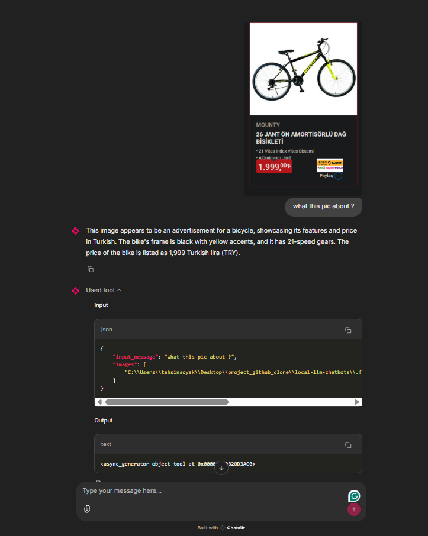
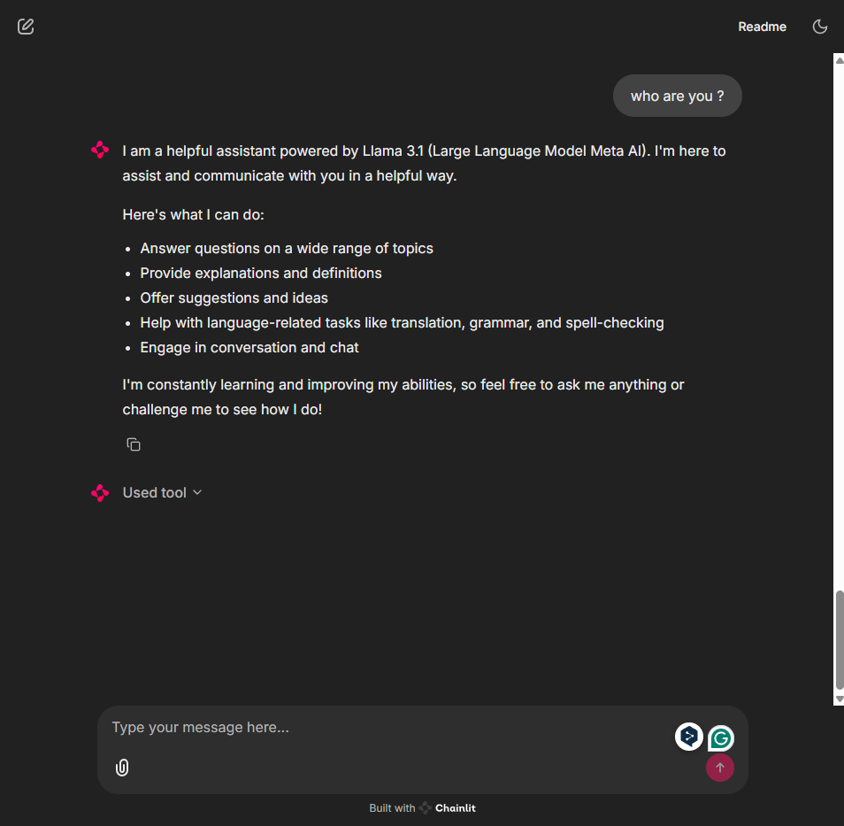

# Local ChatGPT Alternatives with Chainlit and Ollama

This repository contains several demo applications that showcase how to build local chat interfaces powered by various language models using [Chainlit](https://github.com/Chainlit/chainlit) and [Ollama](https://ollama.com/). These demos provide lightweight, local alternatives to ChatGPT, with support for both text-only and multimodal (text and image) interactions.

## Overview

This project includes multiple demos, each leveraging a different local language model:

- **Llama 3.2-Vision**: A full-featured chat application that supports both text and image inputs.
- **Llama 3.1**: A text-only chat application with persistent chat history stored locally.
- **Mistral**: A lightweight text-only chat application.
- **Llama 3.2 Vision**: Another version that supports both text and image inputs.
- **Llama 3.2**: A compact text-only chat application.

Each demo is implemented using the Chainlit framework to create interactive chat applications and uses Ollama to communicate with the local models.

## Features

- **Local Model Inference**: Run your language models entirely on your local machine without external API dependencies.
- **Streaming Responses**: Enjoy real-time token streaming for more natural interactions.
- **Image Support**: Certain demos (e.g., Llama 3.2-Vision) allow you to send image inputs along with text.
- **Chat History**: The Llama 3.1 demo saves chat history in a JSON file, allowing for persistent conversations.

## Screenshots





## Prerequisites

Ensure you have Python installed (preferably Python 3.8 or higher) and that you have access to the necessary local models via Ollama.

## Installation

1. Clone the repository:
   ```bash
   git clone https://github.com/tahsinsoyak/local-llm-chatbots.git
   cd local-llm-chatbots
   ```

2. Install the required Python packages:
   ```bash
   pip install -r requirements.txt
   ```

3. Ensure you have the necessary local models set up with Ollama.
    You can install the models using the following commands:
    ```bash
    ollama pull llama3.2-vision
    ollama pull llama3.1
    ollama pull mistral
    ollama pull llama3.2
    ```


## Usage

To run a specific demo, use the following commands:

- **Llama 3.2-Vision**:
  ```bash
  chainlit run app_llama32vision.py -w
  ```

- **Llama 3.1**:
  ```bash
  chainlit run app_llama31.py -w
  ```

- **Mistral**:
  ```bash
  chainlit run app_mistral.py -w
  ```

- **Llama 3.2**:
  ```bash
  chainlit run app_llama32.py -w
  ```

## Contributing

Contributions are welcome! Please fork the repository and submit a pull request for any enhancements or bug fixes.

## Contact

For any questions or feedback, please contact [tahsinsoyakk@gmail.com](mailto:tahsinsoyakk@gmail.com).

